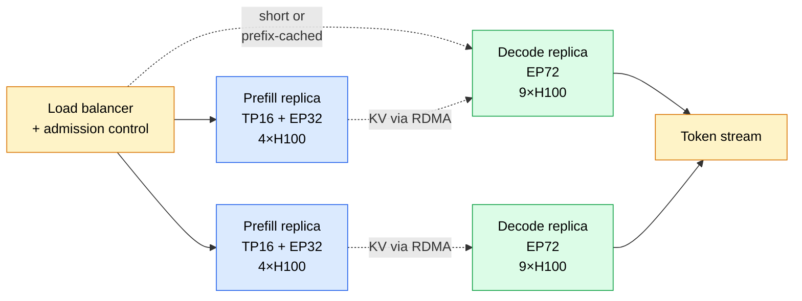
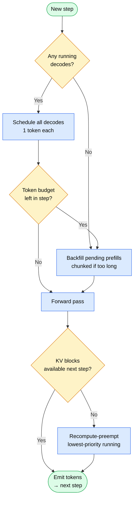
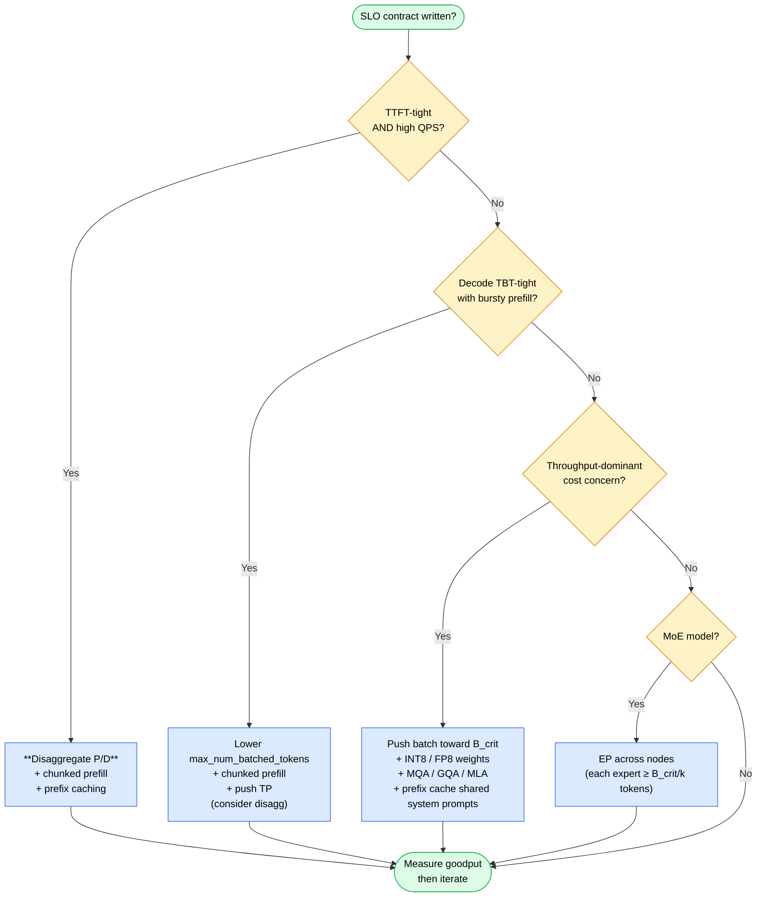

# Model Sizing & Scaling — Reference

A consolidated reference for sizing and scaling decisions in LLM inference, distilled from seven primary sources (listed at the end). Organized so you can reach for a section when sizing a new deployment.

For each topic: **the framework**, **the math**, **the rules of thumb**, **the production data point**.

---

## How to read this doc

- **First time through:** §0 (mental model) → §1–§4 (theory) → §12 (cheat sheet).
- **Sizing a new deployment:** §0.6 (workflow) — pull math from §1 (roofline), §3 (KV), §4 (curve) as you compute.
- **Tuning an existing one:** §9 (vLLM internals) or §10 (TRT-LLM methodology) → §12 (cheat sheet).
- **Sanity-check at the end:** §11 (flowchart).
- **Production case studies:** §5 (Llama-70B worked), §7 (DeepSeek-V3), §8 (Character.AI).

## Glossary

| Term | Meaning |
|---|---|
| **TTFT** | Time To First Token — prefill latency (queue wait + first forward pass) |
| **TBT / TPOT / ITL** | Time Between Tokens — per-decode-step latency (inter-token latency) |
| **AI** | Arithmetic Intensity — FLOPs per byte moved from HBM |
| **MFU** | Model FLOPs Utilization — achieved FLOPs / peak FLOPs |
| **HBM** | High-Bandwidth Memory — the on-chip GPU memory |
| **ICI** | Inter-Chip Interconnect — NVLink on Nvidia, ICI on TPU |
| **ISL / OSL** | Input / Output Sequence Length |
| **B_crit** | Critical batch — the knee where dense matmul flips memory-bound → compute-bound |
| **KV** | Key-Value cache — attention's per-token state; streamed every decode step |
| **TP** | Tensor Parallelism — shard the hidden dim of each matmul across GPUs |
| **PP** | Pipeline Parallelism — shard layer groups across GPUs (introduces bubbles) |
| **EP** | Expert Parallelism — for MoE; shard experts across GPUs |
| **SP** | Sequence Parallelism — shard the sequence dim (helps long-context prefill) |
| **DP** | Data Parallelism — replicate full model across GPUs |
| **FSDP** | Fully Sharded Data Parallelism — gather weights per layer; viable in training, unviable for decode |
| **DP-attn** | Data-parallel attention — each replica handles a subset of sequences through attention |
| **MHA / GQA / MQA / MLA** | Attention variants: Multi-Head / Grouped-Query / Multi-Query / Multi-head Latent |
| **MTP** | Multi-Token Prediction — training-time multi-head used at inference as free spec decode |
| **QPS** | Queries (requests) per second |
| **P:D ratio** | Prefill load : Decode load — drives the disaggregation decision |
| **Goodput** | req/s **subject to** TTFT_p99 AND TBT_p99 SLOs (not raw throughput) |

---

## 0. The Objective & Workflow (start here)

> **Read §0.1–§0.4 in order before §0.5 (the workflow).** The mental model is what makes the steps make sense; without it, the workflow is a checklist that will mislead.

### 0.1 What you're actually optimizing

Inference is a three-axis Pareto problem. You can push on any two; the third pushes back.

```
              Quality (eval accuracy)
                       ▲
                       │
                       │
                       │
     Latency ──────────┼────────── Throughput
   (TTFT, TBT)         │           ($ / Mtok)
                       │
```

- **Latency** (TTFT, TBT, P99) — what a single user experiences.
- **Throughput** (tokens/sec/GPU, $/Mtok) — what your cost sheet sees.
- **Quality** (your eval suite) — what makes the product viable.

Almost every "tuning" decision moves you along a Pareto frontier set by **(hardware, model architecture, workload mix)**. You don't *create* throughput; you redistribute it from one axis to another. Recognizing this kills 80% of bad arguments before they start: "raise the batch" trades latency for throughput, "switch to MLA" trades implementation cost for cache headroom, "disaggregate" trades infra complexity for ability to optimize each phase independently.

**Corollary: more constraints = better performance.** A general-purpose deployment is a Pareto-dominated deployment. Every constraint you can commit to — bounded context, single workload class, known traffic shape, fixed precision — lets you specialize and push *further* on the remaining axes. Quantized beats FP16 on cost; disagg beats mixed on TTFT; prefix-cached beats stateless on warm traffic. The workflow in §0.6 walks knob-by-knob precisely so each added constraint moves you to a tighter frontier rather than sideways on a loose one.

### 0.2 Mental model — capacity planning at token granularity

Inference is **capacity planning where the unit of work is a token, not a request.** Each token costs you HBM bandwidth (to stream weights and KV through the GPU) and FLOPs (to multiply them). Different request shapes consume different ratios of these two resources.

| Auto Scaling concept | Inference equivalent |
|---|---|
| Warm instance pool (fixed cost) | Model weights in HBM |
| Per-instance memory (variable cost) | KV cache per active session |
| ASG min/max | `max_num_seqs`, KV pool size |
| Target-tracking on CPU | Memory-bound regime (BW utilization) |
| Headroom for burst | `gpu_memory_utilization` < 1.0 |
| Spot vs On-Demand | Quantization (cheaper, slightly riskier) |
| Multi-AZ sharding | Tensor Parallelism across NVLink |
| Cross-region replication | Pipeline Parallelism across nodes |
| ALB sticky sessions | Prefix caching / cache-aware routing |
| Two ASGs (web vs worker) | Disaggregated prefill / decode pools |
| Queue depth → scaling trigger | KV pool utilization → admission throttling |
| Target tracking @ 70% util | Stay below ~65% GPU util for tail-stable serving |

Weights are the **fixed amortized cost** — paid every decode step regardless of batch. KV is the **variable cost** — grows linearly with concurrent sessions × context length. Your job is to size the fleet (GPUs, topology) and per-instance behavior (batch, KV policy) to meet SLO at the lowest $/Mtok.

### 0.3 Inference is two workloads, not one

A single request stitches together **two completely different physics regimes**:

| | Prefill | Decode |
|---|---|---|
| What it does | Process whole prompt in parallel | Generate 1 token per step per seq |
| Tokens / step | hundreds–thousands (chunk size) | 1 × num_running_seqs |
| Arithmetic intensity | high (T/2 for attention) | ~1 (one new token streams full KV) |
| Bottleneck | FLOPs | HBM bandwidth |
| MFU (typical) | **40–60%** | **5–15%** |
| Latency metric | TTFT | TBT / ITL |
| Saturated at | batch = 1 with long prompt | needs many concurrent seqs |

**Implication for sizing:** every decision must ask "which phase?" first. The same GPU can be compute-bound for prefill and memory-bound for decode *in the same second*. Mixing them on one server means prefill bursts crater decode TBT — which is why disaggregation (Splitwise / DistServe / Mooncake) became table stakes for TTFT-sensitive products. (See §2 for the deeper comparison.)

### 0.4 Engine parameter taxonomy

Engine knobs split cleanly by what they physically bound. Naming this prevents the common mistake of tuning a "throughput" knob to fix a "latency" symptom.

| Parameter (vLLM / TRT-LLM) | Axis | Physically bounds | When exceeded |
|---|---|---|---|
| `max_model_len` (vLLM) / `max_input_len` + `max_output_len` (TRT-LLM build flags) | per-request, admission | KV slots reserved per sequence; combined context budget | **Reject** at admission |
| `SamplingParams.max_tokens` (vLLM) / `max_output_len` (TRT-LLM) | per-request, runtime | Output tokens per request | **Forced EOS** at limit |
| `max_num_seqs` / `max_batch_size` | concurrency | Number of sequences scheduler holds in flight | **Queue** (request waits) |
| `max_num_batched_tokens` / `max_num_tokens` | per-step work | Total tokens (prefill + decode) in one forward pass | Long chunks **split** (chunked prefill) or sequences **deferred** |
| `gpu_memory_utilization` (vLLM) / `kv_cache_free_gpu_mem_fraction` (TRT-LLM) | memory | HBM fraction for weights + KV pool + activations | OOM at startup if too high |
| `block_size` (vLLM PagedAttention) | KV granularity | Tokens per KV block (alloc unit) | Fragmentation if large; mgmt overhead if small |
| `enable_chunked_prefill` (both) | scheduling | Whether prefill can be split across steps to protect TBT | — |
| `enable_prefix_caching` (vLLM) | scheduling | Reuse KV for shared prompt prefixes | — |

**Two soft scheduling knobs** — `max_num_seqs` and `max_num_batched_tokens` — are *not* memory caps. They're concurrency / work-per-step caps. Actual memory admission is decided per-step by the engine against the KV pool. The right framing: set them high enough that they're not the binding constraint, then let per-step admission throttle to reality.

**Two hard rejection caps** — `max_model_len` and (for TRT-LLM build) `max_input_len` — are admission gates. Set them at the context budget you're *willing to serve* (governed by HBM-fit at target batch), not at workload percentiles. Slicing them by p99-of-traffic turns measurement noise into 503s.

**One forced-stop cap** — `max_output_len` / `SamplingParams.max_tokens` — is a generation length cap. Set from product UX (longest *useful* response), not from output distribution; truncation is acceptable, rejection at admission is not.

### 0.5 Method — analytical bounds, empirical refinement, goodput

Pure analytical sizing produces wrong numbers (engine overhead, scheduling artifacts, paged-KV fragmentation aren't in the equations). Pure empirical sweep wastes hardware time scanning configs the math already ruled out. The right method is a **two-stage pipeline**:

1. **Analytical** (paper, no GPU): use roofline + KV + SLO math (§1, §3, §4) to bound each variable's plausible range. This rules out 80%+ of the search space.
2. **Empirical** (load generator, real GPU): sweep within those bounds using a production-shaped load. Tools: `genai-perf` (NVIDIA) or `vllm benchmark_serving.py`. Use the ISL/OSL distribution from workload characterization — **not** synthetic 128/128.
3. **Optimize on goodput, not throughput**: **goodput = req/s subject to TTFT_p99 and TBT_p99 SLOs**. Raw tokens/sec is a vanity metric — it can climb while SLO satisfaction collapses. (DistServe popularized this distinction; now mainstream.)
4. **Stay below ~65% steady-state utilization**. M/M/1 queueing math: tail latencies blow up above ~70%. This is your replica-sizing headroom factor (≈1.5×).

### 0.6 9-step workflow

Sequential by default. Bracketed steps marked `[co-decided]` are jointly constrained and may require revisiting.

**1. Write down the SLO contract.**
- TTFT_p50 / p99
- TBT_p50 / p99 (or e2e for non-streaming)
- Target throughput at peak (req/s)
- Cost ceiling ($/Mtok or $/req)
- Quality bar (specific eval, specific threshold)
> No numbers → no decisions.

**2. Characterize the workload.**
- Input length distribution (median + p95 + p99) — drives prefill cost.
- Output length distribution — drives decode cost and P:D load ratio.
- Concurrency profile (steady / diurnal / bursty) — drives autoscaling.
- Multi-turn vs single-shot — decides if prefix caching pays.
- Shared system prompt? — decides whether to lock prefix in KV.
- Prefix-shareability (% of prompts sharing prefix) — can swing per-replica throughput 2–5×.

**3. Pick model and attention variant.**
- Smallest model clearing the quality bar on **your** eval (not benchmarks).
- Record attention variant (MHA / GQA / MQA / MLA) — drives KV math in §3.
- Note FP8/INT4-friendliness (varies by model family).

**4. Roofline math on paper (before topology).**
- `KV_per_token = 2 × bytes × n_kv_heads × head_dim × n_layers` (GQA-aware; §3)
- `B_crit = (peak_FLOPs / peak_HBM_BW) × (bits_w / bits_act)` (§1)
- Param footprint at chosen quant.
- P:D load ratio from ISL/OSL (`avg_input_len / avg_output_len`, scaled by prefill MFU advantage).
- **Flag disaggregation early**: if P:D mismatched (>2:1) or TTFT-tight, plan separate prefill/decode pools (§7 has the worked DeepSeek-V3 example).
> If the math says it can't work, no amount of tuning will save you. Pick a smaller model, bigger box, better attention variant, or disagg.

**5. Pick topology and batch ceilings `[co-decided]`.**
- Smallest TP where `weights + KV_at_target_B + activations + 10% overhead` fits per replica.
- TP within an NVLink island only (≤8 H100/H200 per node); PP only when forced; EP for MoE (each expert ≥ `B_crit / k` tokens).
- `max_num_seqs` upper bound = `(HBM − weights − activations − overhead) / KV_per_slot`.
- `max_model_len` = `min(trained_context, HBM-fit at target B)`. **Not** p99 of inputs.
- `max_num_batched_tokens` starting point: powers of 2 ≥ 1024 (TRT-LLM guidance); or DJL's anchor `α × max_batch × max_input` with α ∈ [0.1, 0.2] as a *hint*, not a rule. Should be a multiple of the kernel tile size (Sarathi-Serve constraint).
- TP and batch are co-decided: raising B raises KV pressure, possibly requiring wider TP. Iterate until weights + KV at target B fits with 10% headroom.

**6. Engine baseline.**
- vLLM V1 (chunked prefill default-on) for fast iteration; TensorRT-LLM when squeezing the last %.
- `gpu_memory_utilization = 0.90`; `enable_prefix_caching = on` if shared prefixes; defaults elsewhere.
- **Do not tune yet.** Get a working baseline measurement first.

**7. Measure goodput with production-shaped load.**
- `genai-perf` or `vllm benchmark_serving.py`.
- Use the ISL/OSL distribution from step 2 — **not** synthetic 128/128.
- Sweep **concurrency** first (one axis); plot **goodput** (req/s under SLO).
- Then sweep `max_num_seqs` and `max_num_batched_tokens` together in a small grid (~3×3) around the goodput knee. Pick Pareto.

**8. Apply one knob at a time, in this priority order.**
| Symptom | First knob to try |
|---|---|
| TBT crushed when prompts arrive | Enable chunked prefill, lower `long_prefill_token_threshold` |
| Repeated prompt prefix in workload | Enable prefix caching |
| TTFT spiky under load | Disaggregate prefill from decode |
| Throughput plateau below `B_crit` | Raise `max_num_seqs` and `max_num_batched_tokens` together |
| Quality OK but cost too high | Quantize weights (FP8/INT8), then KV (INT8) |
| ITL still tight after dense tuning | Speculative decoding / MTP |
| Long context dominates KV | Local/sliding-window attention or cross-layer KV sharing |
| MoE expert under-utilized | Raise effective batch via EP / DP-attn |

**9. Replica count, then re-measure end-to-end.**
```
required_decode_tps  = QPS × avg_output_len
required_prefill_tps = QPS × avg_input_len
N = ceil( max(required_decode_tps  / per_replica_decode_tps,
              required_prefill_tps / per_replica_prefill_tps)
          / target_utilization )       # target_util ≈ 0.65 → ~1.5× headroom
```
If disaggregated: size prefill pool and decode pool independently with the same formula, using each phase's own per-replica throughput.

Re-measure end-to-end at N replicas under target QPS. Stop when SLO is met or marginal gain ≤ complexity cost. Each subsequent knob shifts you on the Pareto frontier; it doesn't expand it. Frontier expansion requires model, hardware, or topology change → restart at step 3.

**Corollary: more traffic = more optimizations earn back their complexity.** A 2% goodput win pays for nothing at 10 req/s but matters at 10k req/s. Before adopting a knob, set a traffic threshold below which you don't bother — e.g., "skip prefix caching until shared-prompt traffic exceeds 30%," "skip disaggregation below 100 req/s/region," "skip spec decoding below B = B_crit/2 (verification has no spare cycles at high batch anyway)." This guardrail is the operational form of the §0.1 specialization argument.

### 0.7 The three questions to ask before any change

1. **Which axis am I moving on?** (latency ↔ throughput ↔ quality)
2. **Which axis is paying?** (something has to)
3. **Which phase am I optimizing?** (prefill or decode — different physics)

If you can't answer all three in one sentence, you're not ready to make the change.

---

## 1. The Roofline Mental Model (Scaling Book, Part 7)

> **Takeaway:** Every step on a GPU is either *waiting for bytes* or *waiting for FLOPs*. The roofline tells you which, and at what batch size the regime flips.

Every inference workload sits in one of two regimes, separated by **arithmetic intensity** (FLOPs per byte moved from HBM):

```
AI = FLOPs / Bytes_moved
```

- **Compute-bound** when `AI > peak_FLOPs / peak_HBM_BW`. Time is set by FLOPs.
- **Memory-bound** when `AI < peak_FLOPs / peak_HBM_BW`. Time is set by bandwidth (weight loading).

```
   Achieved FLOPs/s
        ▲
   peak ├──────────────────────────  compute roof (flat)
        │                  ╱
        │              ╱
        │          ╱  ◀── knee at AI = roofline ratio (= B_crit on the batch axis)
        │      ╱
        │   ╱   memory roof (slope = peak HBM bandwidth)
        │ ╱
        │╱
        └──────────────────────────▶ Arithmetic Intensity (FLOPs / byte)
                  ↑
            roofline ratio
        ┌─────────┴──────────┐
        │ Memory-bound       │ Compute-bound
        │ (decode steps)     │ (prefill chunks)
```

**Hardware roofline ratios** (FLOPs per byte, bf16):
| Chip | Peak FLOPs | HBM BW | Roofline (FLOPs/B) |
|------|------------|--------|--------------------|
| TPU v5e | 1.97e14 | 8.2e11 | **~240** |
| H100 SXM | 9.9e14 | 3.35e12 | **~295** (bf16) / ~590 (fp8) |
| H200 | 9.9e14 | 4.8e12 | ~205 (bf16) |

**Critical batch size** — the batch at which a dense matmul transitions from memory- to compute-bound:

```
B_crit ≈ (peak_FLOPs / peak_HBM_BW) × (bits_per_param / bits_per_activation)
```

- bf16 weights + bf16 activations on H100 → `B_crit ≈ 280` tokens
- **int8 weights + bf16 activations → `B_crit` drops 2×** (≈140) — you reach saturation sooner.
- **int8 weights + int8 activations → `B_crit` unchanged** (more FLOPs available).

> Below `B_crit`, latency stays flat as you add requests (you're paying for weight loads either way). Above `B_crit`, latency grows linearly with batch. This is the single most important inference fact.

---

## 2. Prefill vs Decode (Deep Dive)

> **Takeaway:** §0.3 was the headline; this is the canonical reference. Same model, two physics regimes. Treating them as one is the root of most inference inefficiency.

| | Prefill | Decode |
|---|---|---|
| What it does | Process the entire prompt in parallel | Generate 1 token per step |
| Tokens per step | hundreds-thousands | 1 per request |
| Attention AI | `T/2` (≥480 → compute-bound) | `≈1` (always memory-bound) |
| Bottleneck | FLOPs | HBM bandwidth (loading weights + KV) |
| MFU (typical) | **40–60%** | **5–15%** |
| Latency metric | TTFT | TBT / ITL |
| Batching | Natural (tokens within one prompt) | Requires multiple requests |
| Sharding that helps | TP, SP, FSDP | TP only (FSDP/DP useless) |

**The interleaving problem** — why mixed serving hurts TBT, and what the two fixes look like:

```
Mixed P+D, no chunked prefill (long prefill blocks decode):

GPU ▕████████████▏d▕d▕████████████▏d▕d▕d▕████████████▏
     ←─prefill─→               ←─prefill─→     ←─prefill─→
                  ↑ TBT spike    ↑ TBT spike   ↑ TBT spike

With chunked prefill (prefill sliced into small chunks per step):

GPU ▕p+d▕p+d▕p+d▕ d ▕p+d▕p+d▕ d ▕ d ▕p+d▕p+d▕ d ▕p+d▕
     small prefill chunks share each step with decode → TBT smoothed

With disaggregation (separate hardware pools, KV transferred between):

P-pool ▕████████████▏    ▕████████████▏    ▕████████████▏
D-pool ▕d▕d▕d▕d▕d▕d▕d▕d▕d▕d▕d▕d▕d▕d▕d▕d▕d▕d▕d▕d▕d▕d▕d▕
       continuous decode stream, no prefill interruptions
```

**Implication:** Prefill saturates a GPU with batch=1. Decode needs dozens of concurrent requests to saturate. Mixing them means prefill bursts crater decode TBT — the load shape is fundamentally different, and a single MFU figure averaged across the two will mislead any capacity plan. Disaggregation exists precisely to let each phase run at its own optimal MFU and batch on hardware sized for its bottleneck.

**Two practitioner framings for disagg:**

- **`xPyD` notation** — write the topology as `xPyD`, e.g., `2P1D` = 2 prefill replicas per decode replica. Turns the static "3× prefill servers per decode" rule of thumb (§5.2) into a routine sizing variable you can iterate on, separate from the topology of either pool.
- **Conditional disaggregation** — not a binary choice. The decode pool can serve *short* or *prefix-cached* prefills locally (cheap, no KV transfer) and only **escalate long uncached prefills to the prefill pool**. Catches the long-tail without paying KV-transfer cost on every request, and degrades gracefully if the P pool is unavailable.

---

## 3. KV Cache: The Other Bottleneck

> **Takeaway:** Once weights fit, your throughput ceiling is set by KV — both how much fits in HBM (concurrency cap) and how fast it streams (decode-step latency). Attention variant choice (MHA → GQA → MQA → MLA) is a hundred-fold lever on this.

The KV cache is *the* throughput limiter once weights fit. It scales linearly in batch × sequence length, and on decode steps it gets streamed through HBM every token.

**Generic formula (bytes per token, all layers):**
```
KV_per_token = 2 (K+V) × bytes_per_elem × n_kv_heads × head_dim × n_layers
```

**Attention variant comparison** — KV per token, DeepSeek-V3-shaped model (61 layers, 128 heads, head_dim=128), 32K context:

| Variant | Formula (per token, per layer) | DSv3 @ 32K |
|---------|-------------------------------|-----------|
| **MHA** | `2 × n_heads × d_head` | **256 GB** / seq |
| **GQA** (8 groups, e.g., Llama-3) | `2 × n_groups × d_head` | 16 GB |
| **MQA** | `2 × d_head` | 2.00 GB |
| **MLA** (DeepSeek) | `d_c + d_rope` (one latent + one rope key) | **2.18 GB** |

**Visualizing the magnitude gap** (DSv3 shape, 32K context, log axis):

```
MHA   ████████████████████████████████████████████  256 GB / seq
GQA-8 ███                                            16 GB / seq
MQA   ▌                                              2.00 GB / seq
MLA   ▌                                              2.18 GB / seq
        │       │       │        │       │
       1 GB   3 GB    10 GB   30 GB   100 GB   (log scale)
```
**MHA → MLA is a ~120× cache reduction at constant quality** — which is why attention-variant choice is the single highest-leverage decision in the doc.

**MLA insight:** matches MQA on cache size while preserving multi-head expressivity at inference (decompressed back to full heads via low-rank projection). The DeepSeek-V2 paper shows MLA beats GQA on quality at the same cache budget.

**Llama-3-70B worked numbers (Scaling Book Part 8):**
- d_model=8192, n_layers=80, n_heads=64, **n_kv_heads=8** (GQA), head_dim=128
- Per-token KV (int8): `2 × 8 × 128 × 80 = 160 kB`
- Sequence @ 8k: `160 kB × 8192 = 1.3 GB`
- Batch 32 @ 8k: **~42 GB just for KV**, on top of 70 GB int8 weights → 112 GB total → minimum 4×2 TPU v5e (8 chips).

---

## 4. Latency–Throughput Curve (Closed Form)

> **Takeaway:** Per-step latency stays flat as you add concurrency — *until you hit B_crit*. Past it, throughput plateaus and TBT grows linearly. This is the curve that justifies "serve at B_crit, not above" for latency-bound workloads, and "serve at B_crit, not below" for throughput-bound ones.

```
   Tokens/sec (per replica)
        ▲
        │              ___________________  compute roof (flat past B_crit)
        │           ╱
        │        ╱   ◀── knee at B = B_crit
        │     ╱
        │  ╱     memory-bound regime
        │╱      (throughput linear in B; per-step time ≈ constant)
        └──────────────────────────────▶ Concurrent batch B
        0          B_crit          2 × B_crit
                ↑ pick here for      ↑ above here:
                throughput AND       compute scales,
                latency-at-floor     throughput flat,
                                     TBT grows linearly
```

**Memory-bound regime** (most decode setups):
```
Step_time = (B × KV_per_seq + W_params) / Total_HBM_BW
Tokens/s  = B × Total_HBM_BW / (B × KV_per_seq + W_params)
```

**General form** (includes compute term):
```
Step_time = (B × KV) / BW
          + max( 2 × B × Params / FLOPs ,  Params / BW )
```
The first term is KV bytes streamed per step. The `max` picks between *compute time* (left) and *weight-load time* (right) — whichever bottlenecks at the current batch.

**Diminishing returns** kick in when KV memory ≈ param memory in the streamed bytes per step. Past that point, doubling batch buys `<2×` throughput, and TBT starts climbing.

---

## 5. Critical Batch & Llama-70B — Worked Example

> **Takeaway:** Two lenses on the same model. §5.1 derives the knee; §5.2 sizes the full topology around it. Same numbers, different reading.

### 5.1 B_crit derivation (the knee)

Llama-3-70B, int8 weights, bf16 activations, on TPU v5e:

```
B_crit_compute = (peak_FLOPs / peak_HBM_BW) × (bits_w / bits_act)
              = 240 × (8 / 16)
              = 120 tokens / step
```

So at batch ≥ 120 decode tokens in flight, matmuls become compute-bound. The Scaling Book recommends serving at **batch 32** (BS=32 × 1 decode token = 32 tokens/step) → still memory-bound → adding more requests *increases throughput at the same per-step latency.*

**Achieved (4×2 TPU v5e, BS=32, int8):**
- 17 ms per decode step
- 1882 tok/s aggregate → **235 tok/s/chip**

### 5.2 Full topology recap

| Quantity | Value |
|---|---|
| Params | 70 B (int8 → 70 GB) |
| KV per token | 160 kB (int8, GQA-8) |
| Critical batch | B > 120 for compute saturation |
| Recommended topology | 4×2 to 4×4 TPU v5e (8–16 chips) |
| Per-step decode latency | 17 ms @ BS=32 on 4×2 |
| Throughput | 235 tok/s/chip |
| Prefill cost | 0.91 s for 8k @ 40% FLOPs util on 16 chips |
| Disagg ratio | **~3× prefill servers per decode server** (8k prompt / 512 output) |

The **disagg ratio** drops out of the P:D load math: at 8k input / 512 output, prefill compute per request is ~16× decode compute per request, but decode runs 512 steps per request, so steady-state P:D ratio = (16/512) × (QPS_p / QPS_d) ≈ 3:1.

---

## 6. Parallelism Decision Tree

> **Takeaway:** Each shard strategy fixes a different bottleneck — TP cuts step time, PP raises throughput at latency cost, EP makes MoE viable, FSDP is training-only. Pick by what's binding.

| Strategy | Shards | Helps prefill? | Helps decode? | Limit |
|---|---|---|---|---|
| **TP** (Megatron) | Hidden dim of each matmul | Yes | Yes | ICI bandwidth — practical limit ~8 way within node, falls off across nodes |
| **PP** | Layer groups | Yes (throughput) | Marginal (pipeline bubbles hurt latency) | Bubble overhead; needs many micro-batches |
| **EP** | Experts (MoE only) | Yes | Yes | All-to-all bandwidth; raises B_crit by `E/k` |
| **SP** | Sequence dim | Yes (long context) | No | Ring-attention comm |
| **DP** | Whole replicas | Yes | No (replicates weights, doesn't help BW) | — |
| **FSDP** | Weights gathered per layer | Marginal | **Unviable** for decode (param loading dominates) | — |

**TP sweet spot for decode:** push TP *beyond* the FLOP-utilization optimum to reduce per-step latency. The Scaling Book ([jax-ml.github.io/scaling-book/inference](https://jax-ml.github.io/scaling-book/inference/#distributing-inference-over-multiple-accelerators)) derives the ceiling from the FFW block's HBM-vs-ICI competition. The derivation is short but every byte-count term matters; here it is end-to-end.

### Setup — the FFW block under TP

A transformer block's FFW (a.k.a. MLP) takes the residual stream through two matmuls:

```
input  [B × D]  ──Wup──►  hidden [B × F]  ──Wdown──►  output [B × D]
                weight                       weight
              [D × F]                       [F × D]
```

where `D = d_model` (residual width, e.g. 4,096 for Llama-3-8B), `F = d_ff` (FFW intermediate, e.g. 14,336), `B` = tokens in the current decode step.

Megatron-LM TP shards the **`F` dimension** of both weights across `Y` chips, using the classic "column-then-row parallel" pattern:
- **`Wup` (column-parallel):** weight sliced along F → each chip produces a slice of the hidden activations `[B × F/Y]`. **No comm needed** because each chip's slice is self-contained.
- **`Wdown` (row-parallel):** weight sliced along F → each chip computes a *partial sum* of the output `[B × D]`. To get the final answer, the Y chips must **all-reduce** their partial `[B × D]` outputs.

That column→row choice is what makes TP work without per-matmul comm; the only price is one all-reduce per FFW layer.

### Where `2DF` comes from — the HBM weight-load term

Per FFW layer there are two weight matrices: `Wup` (D×F params) + `Wdown` (F×D params) = **2DF params**. At 1 byte per parameter (a unit-less convention the book uses so byte conversions cancel cleanly later), that's `2DF` bytes the chip must stream out of HBM to do one forward pass through this layer's FFW.

With TP=Y, both matrices are sliced along F, so each chip owns `2DF/Y` of those bytes. Streaming time per chip per layer:
```
T_HBM = (2DF / Y) / W_hbm
```
This term **falls as 1/Y** — slice the matrix across more chips, each chip's load shrinks linearly. *Auto Scaling analogy: like cold-loading half the routing rules onto each of Y instances; per-instance load time drops as you add instances.*

### Where `2BD` comes from — the ICI all-reduce term

The all-reduce after `Wdown` moves the partial output tensor `[B × D]` — `B × D` elements per chip. Ring all-reduce, the canonical efficient pattern, moves roughly `2 × (Y-1)/Y × message_size` of data through each link, which simplifies to **`2 × message_size`** for large `Y`. With `message_size = B × D`:
```
T_ICI ≈ (2BD) / W_ici
```
This term is **constant in Y** for large Y — the ring saturates. Adding more chips to the ring doesn't shrink the total traffic, it just rearranges it. *Auto Scaling analogy: every layer demands a cross-AZ state sync of fixed size `B × D`; the round-trip doesn't shrink as you add instances, because it's a fixed amount of data going around a ring regardless of fleet size.*

### The crossover — why `D` and `n_layers` cancel

Setting the all-reduce floor against the now-tiny weight-load time:
```
T_ICI > T_HBM
   2BD / W_ici   >   2DF / (Y · W_hbm)
              │ both sides have factor (2 · D) — cancel
   B / W_ici     >   F / (Y · W_hbm)
   B · Y · W_hbm  >  F · W_ici
   Y > F · W_ici / (B · W_hbm)
   Y > F / (B · β)                with β = W_hbm / W_ici
```

So:
```
Y_max ≈ F / (B · β)
```
- **`d_model` cancels** because it scales weight bytes *and* activation bytes equally (both terms have a `D` factor). The residual width is invisible to the crossover.
- **`n_layers` cancels** if you sum both sides over layers — each layer adds the same multiplier.
- The only model-shape number that survives is **`d_ff`** (= `F`), because that's the dimension the weights span but the activations don't.

### Reading the variables

- `Y_max` = **maximum useful TP degree per replica** for decode latency. Past this, ICI comm dominates and adding TP no longer cuts step time (and the per-token throughput-per-chip starts dropping, because the chips spend more time syncing than computing).
- **`F` is `d_ff`** — a small dimensionless integer (14,336 for Llama-3-8B; 28,672 for Llama-3-70B). **Not "total FLOPs."** This was a common transcription error worth flagging — earlier drafts of this doc had it wrong.
- **`B`** = current batch size (decode-step concurrency). Y_max is *inversely* proportional to B: small batches let you spread the model thin, big batches force you to concentrate.
- **`β = W_hbm / W_ici`**, dimensionless, **hardware-specific**:

| Hardware | HBM BW (GB/s) | ICI BW (GB/s, bidir) | β |
|---|---|---|---|
| H100 SXM5 | 3,350 | 900 (NVLink 4.0) | ~3.7 |
| H200 SXM5 | 4,800 | 900 | ~5.3 |
| A100 SXM4 | 2,039 | 600 (NVLink 3.0) | ~3.4 |
| L4 / A10G / T4 | 300–600 | ~32–64 (PCIe Gen3/4) | ~10–20 |
| TPU v5e | 820 | ~100 | ~8 ✓ (book's example) |

For PCIe-only cards (T4/L4/A10G) β jumps into double digits and TP across PCIe is unviable for decode — the all-reduce floor sits above any reasonable per-step budget.

### Worked example (book's, reproduced)

`F = 16,384`, `B = 32`, `β = 8` (TPU v5e):
```
Y_max = 16,384 / (32 × 8) = 64
```
So on TPU v5e with this workload you can in theory shard up to 64-way before ICI binds.

For Llama-3-8B (`d_ff = 14,336`) on H100 (`β ≈ 3.7`):

| Regime | B | Y_max | What binds first? |
|---|---|---|---|
| Small-batch decode | 8 | ~485 | NVLink fanout (8) |
| Typical decode | 32 | ~121 | NVLink fanout (8) |
| Heavy decode | 128 | ~30 | NVLink fanout (8) |
| Prefill burst | 512 | ~7.6 | **Y_max binds — don't go past TP=8** |
| Big prefill | 2,048 | ~1.9 | **Y_max says TP=1; even 2-way is wasteful** |

The takeaway: for *small-batch decode* on NVLink hardware, Y_max is huge and the physical NVLink fanout (~8) is what binds; the formula doesn't change the recommendation. For *large-batch prefill* or *PCIe-only* hardware, Y_max actually binds and stops you from over-sharding.

### Caveat — SwiGLU FFW

Modern open models (Llama, Mistral, Qwen) use SwiGLU FFW with **three** matrices (`Wgate`, `Wup`, `Wdown`), so the per-layer weight bytes are `3DF`, not `2DF`. The constant cancels on both sides of the inequality and `Y_max` is unchanged — but if you're plugging the formula into a memory budget rather than a Y_max calculation, use the correct constant for your architecture.

### Plain-English summary

You trade FLOP utilization for time-to-token. The smaller your batch, the more aggressively you can push TP (you weren't using all the FLOPs anyway). **Decode wants TP wide; throughput-only prefill wants TP narrow.** Y_max tells you how wide is too wide before the cross-chip sync becomes the floor.

**Sub-GPU partitioning (MIG)** — the dual to TP. When the model is small enough that a whole GPU is wasted (e.g., <3B params on H100), **Multi-Instance GPU** *splits* a single GPU into up to 7 isolated slices, each with its own SM and memory partition. Lets you serve several small replicas on one card with hard performance isolation. Pairs with horizontal autoscaling; irrelevant for large models that already use ≥1 GPU.

**MoE detail (DeepSeek-V3 in SGLang prod):**
- Prefill: TP16 + EP32 over 4×H100 nodes
- Decode: EP72 over 9×H100 nodes
- All-to-all (DeepEP): **~0.17 ms/layer**, optimizable to 0.06 ms

---

## 7. Production-Scale Data Point: DeepSeek-V3

671B total / 37B activated MoE, 256 experts (+32 redundant), MLA, FP8 mixed-precision.

**Architecture lessons:**
- **MLA** chosen over GQA: matches MQA cache size, beats GQA quality.
- **FP8** used end-to-end for both training and inference forward — enables 2× the FLOP roofline on H100 (590 vs 295 FLOPs/B).
- **MTP (Multi-Token Prediction)** at training time provides "free" speculative decoding heads at inference.
- **Multi-Plane Network Topology** isolates collective-comm traffic from request traffic.

**Deployment topology:**



The dashed arrow from LB to D1 is **conditional disaggregation** (§2) — short or cached prefills bypass the P pool.

**LMSYS open-source replication (SGLang, 12×H100 nodes, May 2025):**

| Phase | Nodes | Parallelism | Batch | Tok/s/node |
|---|---|---|---|---|
| Prefill | 4 | TP16 + EP32, DP-attn | 16,384 tok/dev | 50,302 (4k input) |
| Decode | 9 | EP72 | 256 seqs × 2k KV | 22,282 (2k input) |

- TTFT: 2–5 s (DeepSeek's own profile is faster, but at much larger scale)
- ITL: ~100 ms
- **Cost: $0.20 / 1M output tokens** (~⅕ of DeepSeek's API price)

**KV transfer between prefill ↔ decode:** RDMA + scatter-gather, background thread, decode pre-allocates → prefill writes → decode reads on first step.

---

## 8. KV Reduction at Production Scale: Character.AI

> **Takeaway:** A stack of five small wins ≈ one 20× win on KV. Order matters — attention variant first (8×), then KV reuse (2–3×), then sliding-window, then int8 end-to-end, then inter-turn caching.

Stacked techniques cumulatively reduce KV cache **20×+** with no measurable quality regression:

1. **MQA everywhere** (vs GQA in most OSS models): **8× reduction**.
2. **Cross-layer KV sharing**: tie KV cache across neighboring attention layers. **Additional 2–3× reduction**.
3. **Hybrid attention horizons**: interleave **local (sliding-window) attention** with sparse global layers. Drops sequence cost from O(L²) to O(L) on local layers. Only global layers contribute to KV across full context.
4. **Native int8 training**: weights, activations, and KV cache all int8, with custom int8 matmul/attention kernels. **Eliminates train/serve dtype mismatch.** ~2× memory + faster matmul.
5. **Inter-turn caching**: KV for every prefilled prefix and generated message held in **host DRAM**, fetched into HBM on follow-up turns. Removes prefill cost from multi-turn chat in the common case.

Together: ~20× KV reduction → batch sizes and throughput per GPU scale roughly proportionally.

---

## 9. Engine Implementation: vLLM (V1)

> **Takeaway:** A scheduler, a paged KV allocator, and a continuous-batching forward pass. Knowing the scheduler's rules — decode-first, recompute-preemption, token-budget per step — is what makes the tuning knobs make sense instead of being magic.

**Scheduler model:**
- Two queues (`waiting`, `running`); FCFS or priority.
- **Decode prioritized over prefill** every step — decodes drain the running set first, then prefill backfills the token budget.
- Each step has a `max_num_batched_tokens` budget consumed proportionally.
- If KV blocks exhausted: **recompute preemption** evicts low-priority running requests.

**Scheduler flow per step:**



This is why `max_num_batched_tokens` is "decode-protective" — decodes go first, then prefills fight for whatever's left. Lowering it makes prefills wait longer (TTFT up) but ensures decodes never starve (TBT down).

**PagedAttention:**
- Block = `2 × block_size × n_kv_heads × head_size × dtype_bytes` (default `block_size=16`).
- Allocator: free list of typically hundreds of thousands of blocks; `req_id → block list` map.
- Fragmentation: tokens not filling a full 16-token block can't be cached → recomputed on next prefix hit if alignment breaks.

**Continuous batching:** All in-flight sequences flattened into one "super sequence"; per-sequence isolation via position indices + masks. No right-padding.

**Speculative decoding:** Draft model proposes k tokens → main model verifies in one forward over context+drafts → accept/reject left-to-right preserves the main model's distribution. If all k accept, sample `k+1` "for free."

**Prefix caching:** Hash 16-token prompt chunks (rolling hash including previous block hash), key into `cached_block_hash → block`. Cache hits skip prefill compute.

**Tuning knobs (V1 defaults):**
| Knob | Default | Effect |
|---|---|---|
| `gpu_memory_utilization` | 0.80 | Fraction of GPU mem for weights+KV pool; bump to 0.90–0.95 if no OOM headroom needed. |
| `block_size` | 16 | Smaller → more fragmentation; larger → more wasted tail-of-sequence. |
| `max_num_seqs` | — | Hard cap on concurrent requests; throughput ceiling. |
| `max_num_batched_tokens` | — | Token budget per step; raise to fit more prefill, lower to protect decode ITL. |
| `long_prefill_token_threshold` | — | Chunked-prefill split point; lower → prefill bursts get sliced across steps so decode keeps running. |
| `enable_prefix_caching` | off | Big win for multi-turn / shared system prompts. |

**Disaggregation:** First-class via KV connectors (e.g., `SharedStorageConnector`). Prefill instance computes KV → uploads on context-manager exit; decode instance fetches on first step (`start_load_kv` enter, `wait_for_save` exit). Independent auto-scaling of P and D pools.

---

## 10. TensorRT-LLM Tuning Methodology

> **Takeaway:** NVIDIA's official process is a sequential grid search, defaults-first. The Sarathi-Serve numbers below give a starting point that beats blind sweeping. Always optimize on goodput, never on raw throughput.

NVIDIA's recommended sequential grid search (one variable at a time):

1. **Baseline** with all defaults. Capture TTFT, TBT, throughput at the target ISL/OSL.
2. **Build flags** — quantization (FP8 / INT4), kernel fusion choices.
3. **`max_batch_size` and `max_num_tokens`** — set memory ceilings; sweep until KV pool fills.
4. **Sharding (TP vs PP)** — TP first within an NVLink island (≤8 H100 in one node); PP only when the model+KV don't fit.
5. **Runtime** — `kv_cache_free_gpu_mem_fraction` (≈0.9), `scheduler_policy` (in-flight batching), `enable_chunked_context` (almost always on for long prompts).
6. **Speculative decoding** (last) — only after the dense path is tuned.

**Reference target in NVIDIA's guide:** Llama-3.3-70B, 4×H100 NVLink, ISL/OSL 2048/2048.

**Compute- vs memory-bound diagnosis (rule of thumb from the framework, not the guide):**
- `nvidia-smi dmon`: high SM util (>80%) at moderate mem-util → compute-bound → push quant / FP8.
- Low SM util (~30–50%) with high HBM BW util → memory-bound → push batch / KV reduction.

**Token budget calibration (Sarathi-Serve, OSDI '24):** `max_num_tokens` is best calibrated by a **one-time profiling sweep** — find the largest token count per step that still hits TBT SLO. Reported numbers from the paper:
- Strict TBT target: **token budget ≈ 512**.
- Relaxed TBT target: **token budget ≈ 2048**.
- Llama-70B with PP: ~**1536** (PP bubbles slightly raise the per-step budget).
- The budget should be a **multiple of the kernel tile size** or you waste FLOPs on padded compute.

### Modern benchmarking tools (use these, don't hand-roll)

| Tool | What it does | When to use |
|---|---|---|
| `genai-perf` (NVIDIA) | Load gen + percentile reporting (TTFT, ITL, e2e, throughput, **goodput**) | First choice for any OpenAI-compatible endpoint |
| `vllm benchmark_serving.py` | Same shape, vLLM-native; supports random / dataset / sharegpt traces | When iterating on vLLM specifically |
| `nvidia-smi dmon` + `dcgm` | Hardware-side: SM util, HBM BW util, power | Diagnose compute- vs memory-bound at run time |
| Engine built-in finders (TRT-LLM `max_token_finder`, vLLM `--max-model-len auto`) | KV-fit binary search | First-pass HBM-budget sanity |

**Always report goodput, not raw throughput.** Goodput = `req/s such that TTFT_p99 ≤ SLO_TTFT AND TBT_p99 ≤ SLO_TBT`. Raw tokens/sec can climb while SLO satisfaction collapses — DistServe's central observation, now mainstream. A 3×3 grid sweep optimized on raw throughput will reliably pick a config that violates the contract.

---

## 11. Decision Flowchart

> **Takeaway:** A 30-second sanity check at the end of any tuning session — does the recommended config still match the SLO regime you started with?



---

## 12. The Cheat Sheet

| Decision | Default answer | When to revisit |
|---|---|---|
| Mixed P+D on one server? | **No** — disagg if you have any TTFT pressure | Tiny scale, latency budget loose |
| Batch size target | Just above `B_crit` for throughput; well below for latency | Read your SLO; pick the smaller |
| Quantization | int8 / FP8 weights as baseline | Quality-critical eval suite drops |
| KV dtype | int8 KV | Quality regression detected (Char.AI: none observed) |
| Attention variant | GQA-8 if training from scratch; **MLA if cache is the bottleneck** | MQA for extreme cache pressure |
| TP degree | Fill the NVLink island, no more | Cross-node = ICI-bottlenecked |
| PP | Only when model doesn't fit | Pipeline bubbles hurt latency |
| Prefix caching | **On**, always | Pure single-turn, unique-prompt traffic |
| Speculative decoding | Off until dense path tuned | After tuning if ITL still tight |
| Chunked prefill | On for any prompt > 1–2k | Pure short-prompt workload |

---

## Sources

1. **How to Scale Your Model — Parts 7 & 8** (Austin, Douglas, Frostig, Pope et al., Google DeepMind, 2025) — [jax-ml.github.io/scaling-book/inference](https://jax-ml.github.io/scaling-book/inference) and [/applied-inference](https://jax-ml.github.io/scaling-book/applied-inference). Canonical roofline framework + Llama-70B worked example.
2. **Inside vLLM: Anatomy of a High-Throughput LLM Inference System** (vLLM team, Sept 2025) — [blog.vllm.ai/2025/09/05/anatomy-of-vllm.html](https://blog.vllm.ai/2025/09/05/anatomy-of-vllm.html). Engine implementation perspective.
3. **Insights into DeepSeek-V3** (DeepSeek-AI, May 2025) — [arxiv.org/abs/2505.09343](https://arxiv.org/abs/2505.09343). Production-scale architecture lessons (MLA, MoE, FP8, MTP).
4. **Optimizing AI Inference at Character.AI** (2024) — [blog.character.ai/optimizing-ai-inference-at-character-ai-2](https://blog.character.ai/optimizing-ai-inference-at-character-ai-2/). 20× KV reduction recipe.
5. **Deploying DeepSeek with PD Disaggregation** (LMSYS / SGLang, May 2025) — [lmsys.org/blog/2025-05-05-large-scale-ep](https://lmsys.org/blog/2025-05-05-large-scale-ep/). Open replication of DeepSeek prod deployment.
6. **How batch size affects token cost and speed** — Reiner Pope on Dwarkesh (2026). Accessible video walkthrough of the Scaling Book framework. Same author.
7. **TensorRT-LLM Performance Tuning Guide** — [nvidia.github.io/TensorRT-LLM/performance/performance-tuning-guide](https://nvidia.github.io/TensorRT-LLM/performance/performance-tuning-guide). NVIDIA grid-search methodology.
8. **Sarathi-Serve: Efficient LLM Inference via Chunked Prefill** (OSDI '24) — [usenix.org/system/files/osdi24-agrawal.pdf](https://www.usenix.org/system/files/osdi24-agrawal.pdf). Token-budget calibration and chunked-prefill design.
9. **DistServe: Disaggregating Prefill and Decode** (OSDI '24) — [usenix.org/conference/osdi24/presentation/zhong-yinmin](https://www.usenix.org/conference/osdi24/presentation/zhong-yinmin). Origin of **goodput** as the inference SLO metric.
10. **Mooncake: A KVCache-centric Disaggregated Architecture** (ACM ToS, 2026) — [dl.acm.org/doi/10.1145/3773772](https://dl.acm.org/doi/10.1145/3773772). Disagg with early SLO-feasibility rejection.
11. **vLLM Optimization and Tuning (official docs)** — [docs.vllm.ai/en/stable/configuration/optimization](https://docs.vllm.ai/en/stable/configuration/optimization/). Parameter semantics and tuning guidance.
12. **NVIDIA genai-perf benchmarking guide** — [developer.nvidia.com/blog/llm-performance-benchmarking-measuring-nvidia-nim-performance-with-genai-perf](https://developer.nvidia.com/blog/llm-performance-benchmarking-measuring-nvidia-nim-performance-with-genai-perf/). Modern load-gen + percentile reporting.
13. **TRT-LLM `max_num_tokens` finder tutorial (DJL)** — [docs.djl.ai/master/docs/serving/serving/docs/lmi/tutorials/trtllm_finding_max_num_tokens_tutorial.html](https://docs.djl.ai/master/docs/serving/serving/docs/lmi/tutorials/trtllm_finding_max_num_tokens_tutorial.html). Origin of the `α × max_batch × max_input` heuristic (α ∈ [0.1, 0.2]).

**Supporting reads (for the DeepSeek KV table):**
- [DeepSeek-V2 paper](https://arxiv.org/pdf/2405.04434) — original MLA derivation.
- [Wikimedia: DeepSeek KV cache comparison](https://commons.wikimedia.org/wiki/File:DeepSeek_KV_cache_comparison_between_MHA,_GQA,_MQA,_MLA.svg) — the table reproduced above.
